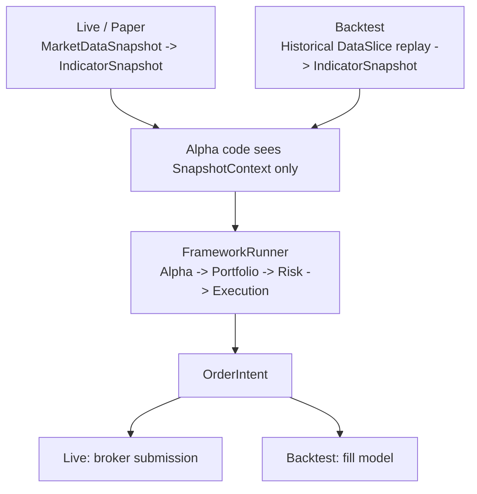

# LEapsQuantEngine

LEAN-style dynamic quant engine v0.

The new engine is being built from a clean root. The previous StockProgram stack is preserved under `reference/stockprogram_legacy` and should be treated as reference material only.

See [docs/agent-artifact-runtime.md](docs/agent-artifact-runtime.md) for the long-running engine, external agent artifacts, validation, safe reload, and isolated backtesting architecture.

See [docs/current-status.md](docs/current-status.md) for the latest implemented slices, benchmark results, logging events, and next development priorities.

See [docs/model-authoring-guide.md](docs/model-authoring-guide.md) for writing universe selection, alpha, portfolio construction, risk, and execution models.

See [docs/runtime-cadence-resolution.md](docs/runtime-cadence-resolution.md) for daily indicator resolution, alpha cadence, portfolio target persistence, and urgent exit rules.

See [docs/backtesting-guide.md](docs/backtesting-guide.md) for sleeve-specific backtest usage, warmup rules, debug options, fundamentals artifacts, fee/slippage simulation, and multi-market research caveats.

See [docs/krx-market-open-runbook.md](docs/krx-market-open-runbook.md) for the morning KRX live-start procedure, service checks, guarded live loop command, Telegram note, and emergency stop steps.

## Target Engine Structure

The long-term engine target follows LEAN Algorithm Framework boundaries, with sleeves as first-class capital and policy compartments.

```mermaid
flowchart LR
    Config["RuntimeConfig / Control Command"] --> Bootstrap["Runtime Bootstrap"]
    Bootstrap --> Sleeve["Sleeve Runtime"]

    Universe["Universe Selection<br/>Coarse -> Fine -> Active"] --> Data["Market Data Adapter<br/>KISDirect / history cache / public data"]
    Data --> MarketSnapshot["MarketDataSnapshot"]
    MarketSnapshot --> Indicators["IndicatorEngine"]
    Indicators --> IndicatorSnapshot["IndicatorSnapshot"]

    IndicatorSnapshot --> Alpha["AlphaModel"]
    Alpha --> Insight["Insight"]
    Insight --> InsightManager["InsightManager<br/>active / expired / superseded"]
    InsightManager --> PortfolioModel["PortfolioConstructionModel"]
    PortfolioModel --> Allocation["PortfolioAllocationTarget<br/>target percent"]
    Allocation --> Sizing["OrderSizingEngine"]
    Sizing --> Target["PortfolioTarget<br/>quantity"]
    Target --> Risk["RiskManagementModel"]
    Risk --> Execution["ExecutionModel"]
    Execution --> Intent["OrderIntent"]
    Intent --> Brokerage["Brokerage Adapter"]
    Brokerage --> Ticket["OrderTicket"]
    Ticket --> Event["OrderEvent / Fill / Cancel / Reject"]
    Event --> PortfolioState["PortfolioState"]

    Sleeve --> Universe
    Sleeve --> PortfolioState
```



The same strategy boundary should work in live, paper, and backtest modes. Live mode consumes explicit broker/market-data adapters such as `KISDirectClient`; backtests should consume deterministic virtual or cached historical feeds.



## Current Implemented Structure

The current v0 implementation has the live snapshot-to-order-intent path connected, plus the first order-ticket and broker gateway boundary. A production live orchestrator still needs to wire continuous submit, poll, fill import, and reconciliation.

```mermaid
flowchart LR
    RuntimeConfig["RuntimeConfigSnapshot"] --> Bootstrap["bootstrap_sleeve_runtime"]
    Bootstrap --> Fine["FineUniverseRuntime"]
    Fine --> Active["UniverseSelectionRuntime<br/>selected + forced symbols"]
    Active --> AlphaInputs["alpha.input_selections<br/>alpha_id -> selection_id"]
    Active --> Worker["BackgroundSnapshotWorker"]
    Worker --> MarketSnapshot["MarketDataSnapshot"]
    MarketSnapshot --> IndicatorEngine["IndicatorEngine"]
    IndicatorEngine --> IndicatorSnapshot["IndicatorSnapshotStore.active"]
    IndicatorSnapshot --> Framework["FrameworkRunner"]
    AlphaInputs --> Framework
    Framework --> AlphaRuntime["AlphaRuntime"]
    AlphaRuntime --> InsightManager["InsightManager"]
    InsightManager --> Portfolio["PortfolioConstructionEngine<br/>EqualWeight / RL PPO model"]
    Portfolio --> TargetBatch["PortfolioTargetBatch<br/>target percent / desired value"]
    TargetBatch --> Sizing["OrderSizingEngine"]
    Sizing --> TargetPlan["OrderSizingBatch<br/>quantity / rounding loss"]
    TargetPlan --> Risk["BasicRiskManagementModel"]
    Risk --> Execution["ImmediateExecutionModel"]
    Execution --> Intent["OrderIntent"]
    Intent --> Coordinator["OrderCoordinator / OrderTicket"]
    Coordinator --> BrokerGateway["PaperBrokerExecutionGateway / BrokerEngineExecutionGateway"]
    BrokerGateway --> OrderEvent["OrderEvent"]
```



Implemented now:

- Universe: coarse file, fine cache refresh, active selection, composite selection union, and forced inclusion for held/open-order/exit-watch/manual symbols.
- Indicators: sleeve-namespaced in-memory state, warmup, 30+ indicator catalog, resolution-gated updates, live snapshot updates, and immutable `IndicatorSnapshot`.
- Alpha: Python Alpha Model loader, `AlphaRuntime`, per-alpha cadence, alpha-specific selected symbol inputs, `Insight`, `InsightBatch`, and example alpha modules.
- Framework: `InsightManager`, `PortfolioConstructionEngine`, target persistence through rebalance cadence, equal-weight portfolio model, `PortfolioAllocationTarget`, `OrderSizingEngine`, basic risk gates, immediate execution, and order-intent output.
- Orders: global order coordination, `OrderTicket`, `OrderEvent`, append-only order runtime state, open-ticket polling, execution-history reconciliation, simulated fills, multi-sleeve order orchestration, paper broker gateway, and a StockProgram-style broker-engine gateway.
- Operations: `runtime-run-once --order-batch-output` persists strategy output as a submit-ready order-intent artifact. `order-runtime-paper-smoke` runs paper submit -> supervisor poll -> final status from that artifact. `order-runtime-submit` commits `OrderIntentBatch` files into tickets and broker submit events behind explicit guards. `order-runtime-status` reads the order runtime store and virtual sleeve account store into an agent/operator status report without touching the broker. `order-runtime-supervise` runs a bounded open-ticket poll plus execution-history reconciliation and returns a final status report. Order runtime commands can route through sleeve-level broker account profiles.
- Runtime: config validation, broker account profiles, runtime bootstrap, one-cycle live smoke command, logging, and summary reports.
- Backtesting: classic `Algorithm.on_data` backtest plus framework alpha replay with immediate fills and report metrics.

Not complete yet:

- Long-running live submit/poll/fill-sync/reconcile orchestration across all sleeves.
- Rich cancel/replace handling and broker fill event ingestion beyond execution-history sync.
- Overseas broker-engine live submit, poll, and account reconciliation. Overseas sleeve routes are explicit now, but broker-engine side effects are blocked until the overseas adapter exists.
- Long-running production daemon/supervisor with scheduled universe reselection.

## Shape

- `Algorithm`: user strategy logic, similar to LEAN's algorithm surface.
- `Engine`: event loop that feeds data slices into algorithms.
- `Sleeve`: budgeted strategy compartment with its own policy and risk boundary.
- `Portfolio`: sleeve virtual account projection for cash, holdings, mark value, and equity.
- `Execution`: converts sleeve-approved targets into order intents.
- `Runtime`: wires config, algorithms, data, and execution together.
- `IndicatorEngine`: sleeve-namespaced incremental indicator state.
- `MarketDataSnapshot` / `IndicatorSnapshot`: stable read models for live/replay consumers.
- `WarmupPolicy`: startup/restart indicator preparation from cached history.
- `BackgroundSnapshotWorker`: bounded/background snapshot update loop.
- `AlphaRuntime`: Python Alpha Model runner that emits insights from snapshots and can skip daily alpha models until their cadence is due.
- `InsightManager`: LEAN-style active/expired/cancelled insight state.
- `PortfolioConstructionEngine`: turns active insights plus the sleeve virtual account portfolio into auditable allocation targets with target percent and desired value.
- `OrderSizingEngine`: turns allocation targets into quantity-based `PortfolioTarget` records from current portfolio state, applying rebalance noise filters and recording rounding loss.
- `FrameworkRunner`: deterministic `Alpha -> Portfolio -> OrderSizing -> Risk -> Execution` v0 pipeline with persisted portfolio targets when rebalance cadence is not due.
- `OrderCoordinator`: converts sleeve order-intent batches into global `OrderTicket` records and collision reports.
- `MultiSleeveOrderOrchestrator`: collects all sleeve order batches, registers ticket ownership, submits through a broker gateway, polls events, and applies fills to the virtual sleeve account ledger.
- `FileOrderRuntimeStateStore`: records tickets and order events as append-only JSONL and reconstructs open tickets after restart.
- `OrderRuntimePaperSmokeRunner`: paper-only end-to-end smoke for submit, supervisor polling, fill application, and final status.
- `OrderRuntimeSubmitter`: validates order-intent batches, dry-runs ticket coordination, blocks unconfirmed broker-engine live submit, and optionally commits through `MultiSleeveOrderOrchestrator`.
- `OrderRuntimeStatusReport`: read-only status view for open tickets, recent events, sleeve cash/holdings, pending notional, and unallocated broker fills.
- `OrderRuntimeSupervisor`: bounded maintenance run that polls open tickets, imports execution history, and reports warnings instead of getting stuck.
- `OpenTicketPollWorker`: reloads open tickets, polls the broker gateway, appends observed events, and applies fill events to virtual sleeve accounts.
- `ExecutionHistoryReconcileWorker`: imports recent broker execution-history fills without stopping on bad rows, skips already-applied order-event fills, and records unknown fills for sleeve allocation.
- `BrokerExecutionGateway`: submits or simulates tickets through paper or local broker-engine adapters and emits normalized `OrderEvent` records.
- `UniverseSelectionModel` / `CompositeUniverseSelectionRuntime`: sleeve-level active universe selection with forced watchlist inclusion and per-selection provenance.
- `RuntimeConfig` / `BrokerAccountRuntimeConfig` / `RuntimeControlCommand`: option snapshots, sleeve-to-account routing, and command-based reload for future UI/control-plane flows.

## Smoke Test

```powershell
py -3 -m pytest -q
```

Current expected result:

```text
270 passed
```

## Run Sample

```powershell
$env:PYTHONPATH='src'
py -3 -m leaps_quant_engine.cli run-once sample_swing_kor_pipeline.json
```

Or install the package in editable mode first:

```powershell
py -3 -m pip install -e .
leapsq run-once sample_swing_kor_pipeline.json
```

## Runtime Options

Runtime options are deliberately thin. Config files declare operational settings and module references; strategy logic, universe ranking, alpha decisions, portfolio construction, and risk rules belong in Python modules.

```text
config file
  -> RuntimeConfigSnapshot(version=sha256:...)
  -> RuntimeControlCommand(reload_config)
  -> cycle-boundary apply
```

Validate a runtime config without starting a live worker:

```powershell
$env:PYTHONPATH='src'
py -3 -m leaps_quant_engine.cli runtime-config-validate configs/runtime/live_us_smoke.json
```

Run one configured runtime cycle:

```powershell
$env:PYTHONPATH='src'
py -3 -m leaps_quant_engine.cli runtime-run-once configs/runtime/live_us_smoke.json --sleeve-id us-live --held IBM --skip-warmup --summary-only
```

Persist the runtime cycle's execution output as a submit-ready artifact:

```powershell
$env:PYTHONPATH='src'
py -3 -m leaps_quant_engine.cli runtime-run-once configs/runtime/leaps_workspace_smoke.json --sleeve-id LEaps --summary-only --order-batch-output ../../data/order-intents/leaps_latest.json
```

The first sample lives at `configs/runtime/live_us_smoke.json`. It references the coarse universe file, the active selection module, alpha module path, portfolio construction module path, sleeve cash, market-data provider choice, rate limit, warmup settings, rebalance settings, and worker cadence. `bootstrap_sleeve_runtime(...)` turns the snapshot into provider adapters, optional fine refresh, active universe selection, alpha runtime, portfolio construction engine, sleeve portfolio, `FrameworkRunner`, and `BackgroundSnapshotWorker`. The running process should keep the parsed `RuntimeConfigSnapshot` in memory and only reload the file after a control command.

`runtime-run-once` returns both worker and framework sections: worker covers market snapshot collection and indicator publication; framework covers `Alpha -> InsightManager -> Portfolio -> OrderSizing -> Risk -> Execution -> OrderIntent`.

When `indicators.warmup_enabled=true`, runtime bootstrap warms indicators before active selection and passes the warmed snapshot into selection models. If warmup is incomplete, the runtime marks the cycle with `warmup_not_ready` and blocks new entries instead of making cold-start momentum decisions.

`broker_accounts` can define separate domestic and overseas virtual-account/order-runtime stores. A sleeve can set `broker_account_id` so order runtime commands resolve the correct account route without reusing the old `portfolio.account_store_path` fallback. `order-runtime-status` returns `broker_account_id` and `market_scope`; overseas `broker-engine` submit/poll/reconcile is currently blocked intentionally.

Dry-run or commit an order-intent batch file into the order runtime:

```powershell
$env:PYTHONPATH='src'
py -3 -m leaps_quant_engine.cli order-runtime-submit configs/runtime/leaps_workspace_smoke.json data/order-intents/sample.json --summary-only
py -3 -m leaps_quant_engine.cli order-runtime-submit configs/runtime/leaps_workspace_smoke.json data/order-intents/sample.json --commit --broker paper --summary-only
py -3 -m leaps_quant_engine.cli order-runtime-paper-smoke configs/runtime/leaps_workspace_smoke.json data/order-intents/sample.json --summary-only
```

Read the current order runtime and sleeve virtual-account state:

```powershell
$env:PYTHONPATH='src'
py -3 -m leaps_quant_engine.cli order-runtime-status configs/runtime/leaps_workspace_smoke.json --summary-only
```

Run one bounded order maintenance pass:

```powershell
$env:PYTHONPATH='src'
py -3 -m leaps_quant_engine.cli order-runtime-supervise configs/runtime/leaps_workspace_smoke.json --summary-only
```

## Notifications

Notifications follow the StockProgram local-first pattern: write an auditable
local record first, then try Telegram only when credentials are configured.

Environment:

```text
LEAPS_TELEGRAM_BOT_TOKEN
LEAPS_TELEGRAM_CHAT_ID
```

The StockProgram variable names are also accepted as fallback for migration.

```powershell
$env:PYTHONPATH='src'
py -3 -m leaps_quant_engine.cli notification-status
py -3 -m leaps_quant_engine.cli notify-user-message --category order --title "Order queued" --message "LEaps KRX:005930 buy 1" --summary-only
py -3 -m leaps_quant_engine.cli order-runtime-submit configs/runtime/leaps_workspace_smoke.json data/order-intents/sample.json --commit --broker paper --notify --summary-only
```

## KIS Adapter

KIS is treated as an external market data provider, not as part of the deterministic engine core.

```powershell
Copy-Item .env.example .env
# fill KIS_APP_KEY and KIS_APP_SECRET
$env:PYTHONPATH='src'
py -3 -c "from leaps_quant_engine.adapters.kis import KISBrokerEngineMarketDataProvider; p=KISBrokerEngineMarketDataProvider.from_env(); print(p.health_check())"
```

CLI shortcuts:

```powershell
$env:PYTHONPATH='src'
py -3 -m leaps_quant_engine.cli kis-health
py -3 -m leaps_quant_engine.cli kis-quote 005930 --market KRX
```

## Backtesting

Backtests use the same engine surface with a virtual market data provider:

```python
from datetime import datetime
from leaps_quant_engine import Symbol, Bar, VirtualMarketDataProvider

symbol = Symbol("005930", "KRX")
provider = VirtualMarketDataProvider.from_bars([
    Bar(symbol, datetime(2026, 5, 4), 100, 100, 100, 100),
    Bar(symbol, datetime(2026, 5, 7), 110, 110, 110, 110),
])
```

`run_backtest(...)` returns report-ready metrics: CAGR, Sharpe, MDD, turnover, average holding days, average exposure, win rate, trade count, and order count. Metrics are available at both aggregate and sleeve levels through `result.metrics` and `result.metrics_by_sleeve`.

Framework alpha backtests use the newer LEAN-style path:

```text
Historical DataSlice replay
  -> IndicatorEngine
  -> IndicatorSnapshot
  -> FrameworkRunner
  -> AlphaRuntime
  -> InsightManager
  -> PortfolioConstructionEngine
  -> PortfolioTargetBatch (target percent / desired value)
  -> OrderSizingEngine
  -> OrderSizingBatch (quantity / rounding loss)
  -> RiskManagement
  -> Execution
  -> immediate fill model
  -> BacktestMetrics
```

CLI smoke:

```powershell
$env:PYTHONPATH='src'
py -3 -m leaps_quant_engine.cli framework-backtest-daily configs/universes/swing_kor_core.json examples/alpha/price_above_sma_alpha.py --sleeve-id swing-kor --summary-only
```

Runtime-config sleeve backtests use the sleeve's configured selection, alpha,
portfolio, risk, and execution models:

```powershell
$env:PYTHONPATH='src'
py -3 -m leaps_quant_engine.cli runtime-backtest-daily configs/runtime/leaps_workspace_smoke.json --sleeve-id LEaps --start 2023-05-10 --end 2026-05-08 --cash 2000000 --source finance-datareader --summary-only
```

This path runs configured `universe.active.selection_models` on each backtest
cycle and passes `alpha.input_selections` into `AlphaRuntime`, so research can
exercise the same selection-to-alpha wiring used by runtime.
`leaps_workspace_smoke` now wires LEaps to the USD-only
`configs/universes/leaps_us_research_core.json` universe and the
`portfolios/rl_ppo_constructor.py` model. Train the local PPO policy ensemble
with:

```powershell
$env:PYTHONPATH='src'
py -3 -m leaps_quant_engine.cli train-rl-portfolio-constructor configs/runtime/leaps_workspace_smoke.json --sleeve-id LEaps --start 2021-05-10 --end 2026-05-08 --source finance-datareader --timesteps 20000 --ensemble-seed 7 --ensemble-seed 17 --ensemble-seed 29 --seed 7 --output-dir data/rl --summary-only
```

The RL model chooses allocation percentages only; order sizing, risk, execution,
and fills stay in the normal deterministic framework pipeline. The training
reward is shape-aware: downside return, volatility, drawdown increase,
underwater state, turnover, and missed upside are penalized so CAGR does not
dominate model selection.
The current policy uses an attention feature extractor: selector/alpha top-k
candidates become asset tokens, and a small Transformer encoder reads those
tokens before PPO chooses gross exposure.
The current selected runtime profile keeps equal allocation inside the selected
top-k basket after PPO chooses gross exposure; risk-softmax weighting remains an
experimental option.

The LEaps workspace alpha modules now use risk-adjusted scoring before
portfolio construction: momentum confirms fast/slow trend and penalizes
normalized volatility, while ETF rotation uses trend-filtered momentum and
normalized volatility rather than raw price standard deviation.

## Indicators

Indicators follow a LEAN-like incremental interface:

```python
from leaps_quant_engine import SimpleMovingAverage

sma = SimpleMovingAverage(20)
point = sma.update(bar)
if sma.is_ready:
    print(sma.current.value)
```

The v0 catalog supports 30+ lightweight indicators, including SMA, EMA, momentum, ROC, rolling min/max/range, variance, standard deviation, z-score, ATR, gap percent, drawdown, VWAP, OBV, PVT, accumulation/distribution, and rolling dollar volume.

Universe files can register symbol-level indicator plans:

```python
from leaps_quant_engine import IndicatorEngine
from leaps_quant_engine.universe import load_universe_definition

universe = load_universe_definition("configs/universes/swing_kor_core.json")
engine = IndicatorEngine()
engine.register_universe("swing-kor", universe)
```

Indicator runtime checks:

```powershell
$env:PYTHONPATH='src'
py -3 -m leaps_quant_engine.cli indicators-kis-once sample_swing_kor_pipeline.json --sleeve-id swing-kor
py -3 -m leaps_quant_engine.cli indicators-kis-once sample_swing_kor_pipeline.json --sleeve-id swing-kor --warmup-start 2026-05-01 --warmup-end 2026-05-07
py -3 -m leaps_quant_engine.cli indicators-backtest-once sample_swing_kor_pipeline.json --sleeve-id swing-kor
```

`indicators-kis-once` pulls latest bars through the engine-owned KIS adapter boundary. `indicators-backtest-once` verifies the configured sleeve universe can be loaded without touching KIS; deterministic backtest updates are covered through `VirtualMarketDataProvider`.

Daily indicator warmup:

```powershell
$env:PYTHONPATH='src'
py -3 -m leaps_quant_engine.cli warmup-indicators-daily configs/universes/swing_kor_core.json --sleeve-id swing-kor --summary-only
```

Warmup loads cache-first daily history through `KISDirectClient` and the local file cache, calculates the required trailing bar count from each configured indicator's `warmup_period`, updates in-memory indicator state, and emits a readiness report. This is the startup/restart step before a future live snapshot worker begins publishing indicator snapshots.

Daily indicator cycle benchmark:

```powershell
$env:PYTHONPATH='src'
py -3 -m leaps_quant_engine.cli benchmark-indicators-daily configs/universes/benchmark_kor_200.json --sleeve-id benchmark-kor
```

The benchmark replays cached KIS daily history for the configured universe and measures only `IndicatorEngine.on_data(DataSlice)` latency. History loading and replay-feed build time are reported separately.
It no longer requires the local StockProgram `market-data-engine` HTTP server; the default KIS cache path is `data/kis-cache`.

Live snapshot indicator check:

```powershell
$env:PYTHONPATH='src'
py -3 -m leaps_quant_engine.cli live-indicators-once configs/universes/us_live_smoke.json --sleeve-id us-live --min-success 3 --rate-limit-per-second 20
```

Bounded background snapshot worker check:

```powershell
$env:PYTHONPATH='src'
py -3 -m leaps_quant_engine.cli snapshot-worker-run configs/universes/swing_kor_core.json --sleeve-id swing-kor --cycles 1 --interval-seconds 0 --summary-only
```

The worker optionally warms indicators from cached daily history, collects a best-effort live market snapshot, evaluates freshness/quality, updates `IndicatorEngine`, and publishes the active `IndicatorSnapshotStore` snapshot. The returned report separates warmup, collection, and indicator update timing.

Python alpha smoke:

```powershell
$env:PYTHONPATH='src'
py -3 -m leaps_quant_engine.cli alpha-run-snapshot configs/universes/swing_kor_core.json examples/alpha/price_above_sma_alpha.py --sleeve-id swing-kor --min-success 2 --rate-limit-per-second 20 --summary-only
```

Alpha Models are normal Python files. A module can expose `create_alpha_model()`, `ALPHA_MODEL`, or a module-level `generate(context)` function. Alpha reads `SnapshotContext`, emits `Insight` records, and never creates orders directly. Daily/swing modules may declare `EVALUATION_CADENCE = "once_per_day"` and `INPUT_RESOLUTION = "daily"` so minute-level framework cycles do not regenerate the same thesis every minute.

For the full model contract, including selection-to-alpha input wiring, see [docs/model-authoring-guide.md](docs/model-authoring-guide.md).

Example alpha modules:

- `examples/alpha/live_quote_smoke_alpha.py`: short-lived live quote smoke insights for configured runtime checks.
- `examples/alpha/momentum_strategy_alpha.py`: price above moving average plus positive momentum.
- `examples/alpha/etf_rotation_alpha.py`: rank ETFs by momentum with a volatility penalty and emit top-weight UP insights.
- `examples/alpha/volatility_trailing_stop_alpha.py`: emit FLAT exit insights when price breaks a volatility-adjusted trailing stop.

`Insight` is a prediction artifact, not an order. It carries symbol, type, direction, generated/expiry time, confidence, optional magnitude, optional portfolio weight hint, source alpha id, and reason metadata. `InsightManager` ingests new `InsightBatch` objects, supersedes older same-alpha/same-symbol signals, expires old insights, and exposes the active insight set for portfolio construction.

Framework pipeline v0:

```text
IndicatorSnapshot
  -> AlphaRuntime
  -> InsightManager
  -> PortfolioConstructionEngine
  -> PortfolioTargetBatch
  -> OrderSizingEngine
  -> OrderSizingBatch
  -> PassThroughRiskManagementModel
  -> ImmediateExecutionModel
  -> OrderIntent
```

This path is implemented by `FrameworkRunner`. Portfolio construction reads active insights and the sleeve's virtual account portfolio, creates auditable `PortfolioTargetBatch` records, and emits allocation targets that explain target percent and desired value. `OrderSizingEngine` then converts those allocation targets into integer quantity targets from the current portfolio, current price, current cash/equity, and `RebalancePolicy`, records rounding loss, and applies cash reserve, minimum quantity delta, and minimum order notional filters. If portfolio cadence is not due, the runner reuses the last allocation targets, but sizing, risk, and execution still run every cycle. Portfolio construction can flatten held symbols when their active insight becomes inactive on a due rebalance. Urgent exits should live in always-on risk or quote-resolution exit models. The configured runtime bootstrap now runs this framework path immediately after the active indicator snapshot is published.

Portfolio Construction Models can be injected as Python model modules, similar to Alpha Models:

```json
{
  "portfolio": {
    "model": "examples/portfolio_models/equal_weight.py",
    "parameters": {
      "max_portfolio_pct": 1.0,
      "long_only": true
    },
    "rebalance": {
      "cash_reserve_pct": 0.0,
      "min_order_notional": 0.0,
      "min_quantity_delta": 1,
      "cadence": "once_per_day"
    }
  }
}
```

Portfolio Construction Model modules should expose `create_portfolio_model(params)`, `create_model(params)`, or `PORTFOLIO_MODEL`. Config chooses model references and numeric settings; target construction logic stays in Python.

Active universe selection smoke:

```powershell
$env:PYTHONPATH='src'
py -3 -m leaps_quant_engine.cli select-active-universe configs/universes/benchmark_kor_200.json --sleeve-id benchmark-kor --top-n 60 --summary-only
```

The v0 selector treats the input universe file as a coarse universe, scores symbols from an `IndicatorSnapshot`, selects active candidates, and then force-includes held/open-order/exit-watch/manual symbols in the final live universe.

Active-only live snapshot worker smoke:

```powershell
$env:PYTHONPATH='src'
py -3 -m leaps_quant_engine.cli active-snapshot-worker-run configs/universes/us_live_smoke.json --sleeve-id us-live --top-n 2 --held IBM --cycles 1 --interval-seconds 0 --skip-worker-warmup --min-success 2 --rate-limit-per-second 20 --summary-only
```

This uses the coarse US file, selects only the first two static active symbols, force-includes held `IBM`, and updates only the resulting live universe.

Fine universe refresh smoke:

```powershell
$env:PYTHONPATH='src'
py -3 -m leaps_quant_engine.cli fine-universe-refresh configs/universes/us_live_smoke.json --rate-limit-per-second 20 --include-entries
```

Fine refresh is the paced cache tier between coarse and active. It updates a broader candidate set, tracks per-symbol freshness/failure state, and lets active selection consume only fresh fine symbols.

Recent US smoke timing:

```text
fine refresh 4 symbols: about 857 ms
active worker 3 symbols: about 2,358 ms collection
indicator update + snapshot publish: about 0.206 ms
```

The main bottleneck is still KIS/market-data-engine collection, not engine-side indicator or alpha computation.

Recent configured runtime smoke:

```text
runtime-run-once live_us_smoke:
  fine refresh 4 symbols: about 538 ms on a warm local cache
  active worker 3 symbols: about 262 ms collection
  indicator update + snapshot publish: about 0.140 ms
  framework Alpha -> OrderIntent: about 0.252 ms
  result: 3 insights, 3 approved risk decisions, 3 buy order intents
```

Recent Korean minute framework backtest smoke:

```text
date: 2026-05-08
symbols: 005930, 000660, 035420
resolution: 1 minute
loaded bars: 1,143
data slices: 381
indicator snapshots: 381
framework cycles: 381
alpha: price-above-sma-demo
insights: 424
orders: 21
history load: about 2,979 ms
framework backtest loop: about 158 ms
framework stage total: about 59 ms
```

The intraday smoke uses an annualized CAGR formula, so CAGR is not meaningful for a single trading day. For minute-level reports, prefer total return, drawdown, turnover, exposure, win rate, and trade count.

Recent Korean five-year daily framework backtest smoke:

```text
source: FinanceDataReader
period: 2021-05-10 -> 2026-05-08
symbols: 005930, 000660, 035420
loaded bars: 3,672
data slices: 1,224
indicator snapshots: 1,224
framework cycles: 1,224
alpha: price-above-sma-demo
insights: 1,600
orders: 991
buy orders: 509
sell orders: 482
history load: about 791 ms
framework backtest loop: about 681 ms
framework stage total: about 520 ms
total return: 243.20%
CAGR: 28.01%
Sharpe: 1.00
MDD: 42.45%
turnover: 17.20
average holding days: 267.24
average exposure: 97.19%
win rate: 55.81%
trade count: 482
```

The local KIS/broker-engine daily cache path currently returned only 30 recent trading sessions for the same requested five-year window because the legacy daily operation filters dates after receiving the provider payload. Use it as a cache smoke until a paged KIS history path or separate historical provider is wired into the new engine.

Recent Korean 200-symbol five-year daily framework load test:

```text
source: FinanceDataReader
period: 2021-05-10 -> 2026-05-08
universe: benchmark_kor_200
symbols with data: 200
partial-history symbols: 30
indicator count per symbol: 31
loaded bars: 225,051
estimated indicator updates: 6,976,581
data slices: 1,224
average symbols per slice: 183.87
framework cycles: 1,224
alpha: momentum-strategy-demo
insights: 56,914
orders: 101,627
history load: about 53,043 ms
framework backtest loop: about 38,786 ms
framework stage total: about 4,094 ms
average framework cycle: about 3.34 ms
p95 framework cycle: about 8.72 ms
```

The load test exposed and fixed an `InsightManager` scaling issue. Active insights are now indexed by sleeve/symbol/alpha/type, so supersede/expire/active queries operate over active records instead of scanning all historical insight records.

Server/debug logging can be enabled without changing the JSON report on stdout:

```powershell
$env:PYTHONPATH='src'
py -3 -m leaps_quant_engine.cli --log-level INFO --log-json --log-file logs/live-snapshot.jsonl live-indicators-once configs/universes/us_live_smoke.json --sleeve-id us-live --min-success 3
```

For mixed overseas exchanges, universe symbols may include metadata:

```json
{
  "id": "us-live-smoke",
  "market": "US",
  "symbols": [
    {"ticker": "NVDA", "exchange": "NAS"},
    {"ticker": "IBM", "exchange": "NYS"}
  ],
  "indicators": [
    {"name": "close", "type": "close", "period": 1}
  ]
}
```

`live-indicators-once` collects quote bars through the in-process KIS adapter boundary, closes a `MarketDataSnapshot`, updates `IndicatorEngine`, and publishes an `IndicatorSnapshot`. Symbol failures are reported instead of killing the entire snapshot when `--min-success` is satisfied. The default live quote pace comes from `MARKET_DATA_ENGINE_RATE_LIMIT_PER_SECOND` and can be overridden per run with `--rate-limit-per-second`; the KIS-backed adapter clamps this to 20/s.
Useful log events include `market_data_snapshot.collect.start`, `market_data_snapshot.collect.symbol_failed`, `market_data_snapshot.collect.complete`, `indicator_snapshot.publish`, and `live_indicator_snapshot.complete`.
Worker runs also emit `background_snapshot_worker.warmup.complete` and `background_snapshot_worker.cycle.complete`.
Alpha runs emit `alpha_runtime.model.complete` and `alpha_runtime.batch.publish`.
File logs rotate by default at 10 MB with 5 backups; tune with `--log-max-bytes` and `--log-backup-count`.
