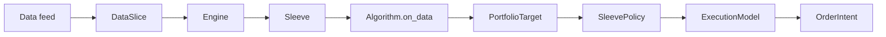
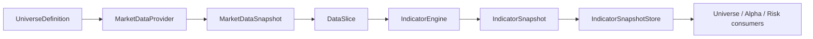

# Architecture v0

## Core Flow

The original simple algorithm flow remains:

The current market-data/indicator slice adds a snapshot path:

## Design Notes

- The engine owns the event loop.
- Algorithms produce desired sleeve-level holdings, not broker orders.
- Sleeves apply capital and risk policy before execution.
- Execution emits `OrderIntent` records. Broker submission is a later adapter concern.
- Portfolio state is explicit and replayable.
- Runtime can build an `Engine` from pipeline JSON and run a single sample slice through the CLI.
- Any live pipeline stage must be reproducible in the backtest runtime with the same interface.
- Indicator state is mutable in memory, but downstream consumers should read immutable `IndicatorSnapshot` objects.
- Live market-data collection may be best-effort. Snapshot quality is controlled by `min_success` and should later become a full freshness/degraded-state policy.
- Data collection time and indicator update time must be measured separately.

## Current Components

- `leaps_quant_engine.backtesting`: virtual provider and report metrics.
- `leaps_quant_engine.indicators`: indicator catalog, registry, and engine.
- `leaps_quant_engine.snapshots`: indicator snapshot values and stores.
- `leaps_quant_engine.market_data_snapshot`: market-data snapshot collection and indicator snapshot publication.
- `leaps_quant_engine.live_snapshot`: one-shot live snapshot runner.
- `leaps_quant_engine.adapters.kis`: local broker/market-data-engine adapters.
- `leaps_quant_engine.logging`: JSON/rotating logging setup.

## Legacy Mapping

The old stack's useful ideas map into the new engine like this:

- `total_orchestrator` and `stack_orchestrator` become runtime/service orchestration, outside the deterministic core.
- Contract outputs become strategy targets or risk instructions.
- Order-chain records become explicit execution/order-intent lifecycle records.
- Sleeve workspaces become first-class `Sleeve` instances with policy, cash, holdings, and algorithm ownership.
