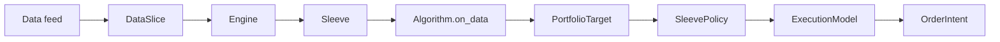

# Architecture v0

## Core Flow

## Design Notes

- The engine owns the event loop.
- Algorithms produce desired sleeve-level holdings, not broker orders.
- Sleeves apply capital and risk policy before execution.
- Execution emits `OrderIntent` records. Broker submission is a later adapter concern.
- Portfolio state is explicit and replayable.
- Runtime can build an `Engine` from pipeline JSON and run a single sample slice through the CLI.
- Any live pipeline stage must be reproducible in the backtest runtime with the same interface.

## Legacy Mapping

The old stack's useful ideas map into the new engine like this:

- `total_orchestrator` and `stack_orchestrator` become runtime/service orchestration, outside the deterministic core.
- Contract outputs become strategy targets or risk instructions.
- Order-chain records become explicit execution/order-intent lifecycle records.
- Sleeve workspaces become first-class `Sleeve` instances with policy, cash, holdings, and algorithm ownership.
