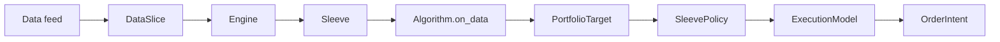

# Architecture v0

## Core Flow

The original simple algorithm flow remains:

The current market-data/indicator slice adds a snapshot path:

```mermaid
flowchart LR
    Universe["UniverseDefinition"] --> Provider["MarketDataProvider"]
    Provider --> MDS["MarketDataSnapshot"]
    Provider --> Warmup["WarmupPolicy / cached history"]
    Warmup --> IE["IndicatorEngine"]
    MDS --> Slice["DataSlice"]
    Slice --> IE
    IE --> IS["IndicatorSnapshot"]
    MDS --> Quality["SnapshotFreshnessPolicy"]
    Quality --> IS
    IS --> Store["IndicatorSnapshotStore"]
    Worker["BackgroundSnapshotWorker"] --> Warmup
    Worker --> MDS
    Worker --> Store
    Store --> Context["SnapshotContext"]
    Store --> Selection["UniverseSelectionModel"]
    Coarse["Coarse UniverseDefinition"] --> Fine["FineUniverseRuntime / FineUniverseCache"]
    Fine --> Selection
    Selection --> Active["Active UniverseDefinition"]
    Active --> Worker
    Context --> Alpha["AlphaRuntime / Python AlphaModel"]
    Alpha --> Insights["InsightBatch"]
    Insights --> Manager["InsightManager"]
    Manager --> PC["PortfolioConstructionModel"]
    PC --> TargetPlan["PortfolioTargetPlan<br/>current -> target -> delta"]
    TargetPlan --> Risk["RiskManagementModel"]
    Risk --> ExecModel["ExecutionModel"]
    ExecModel --> OrderIntent["OrderIntent"]
    OrderIntent --> Future["Order ticket / events / PortfolioState"]
    UI["UI / CLI / operator"] --> Command["RuntimeControlCommand"]
    Config["Runtime config file"] --> Snapshot["RuntimeConfigSnapshot"]
    Command --> Controller["RuntimeConfigController"]
    Controller --> Snapshot
    Snapshot --> Bootstrap["Runtime Bootstrapper"]
    Bootstrap --> Provider["Provider adapters"]
    Bootstrap --> Fine
    Bootstrap --> Selection
    Bootstrap --> Alpha
    Bootstrap --> Worker
```

## Design Notes

- The engine owns the event loop.
- Algorithms produce desired sleeve-level holdings, not broker orders.
- Sleeves apply capital and risk policy before execution.
- Execution emits `OrderIntent` records. Broker submission is a later adapter concern.
- Portfolio state is explicit and replayable.
- Runtime can build an `Engine` from pipeline JSON and run a single sample slice through the CLI.
- Any live pipeline stage must be reproducible in the backtest runtime with the same interface.
- Indicator state is mutable in memory, but downstream consumers should read immutable `IndicatorSnapshot` objects.
- Live market-data collection may be best-effort. Snapshot quality is controlled by `min_success` and should later become a full freshness/degraded-state policy.
- Data collection time and indicator update time must be measured separately.
- `SnapshotFreshnessPolicy` classifies snapshots as `fresh`, `degraded`, `stale`, or `invalid` using complete ratio, age, collection duration, and failure counts.
- `IndicatorSnapshot` carries the quality report so future alpha/risk stages can gate new entries or risk checks without re-evaluating raw provider details.
- `WarmupPolicy` is a startup/restart concern. It loads cache-first daily history, warms the in-memory `IndicatorEngine`, and reports readiness before live snapshot updates begin.
- `BackgroundSnapshotWorker` is the first runtime orchestration object. It composes warmup, snapshot collection, freshness evaluation, indicator update, and active snapshot publication.
- `AlphaRuntime` runs trusted Python Alpha Models against immutable `SnapshotContext` inputs and emits `InsightBatch` outputs.
- Alpha hot reload should happen by staging a pending model and activating it at the next snapshot boundary.
- `InsightManager` stores active insight state. Alpha models only emit new insights; portfolio construction consumes the current active insight set.
- `FrameworkRunner` is the first deterministic model pipeline runner for `Alpha -> PortfolioConstruction -> RiskManagement -> Execution`.
- The portfolio layer assumes each sleeve has its own virtual account projection; KIS account-level holdings are not part of the deterministic core contract.
- `EqualWeightPortfolioConstructionModel` converts active up insights plus the sleeve portfolio projection into quantity targets and can emit flatten targets when held or previously managed symbols lose active insight support.
- `PortfolioTargetPlan` records current quantity/value, target quantity/value, and delta so Risk can reason about entries, exits, and rebalances.
- `PassThroughRiskManagementModel` proves the risk stage contract while leaving real risk gates for the next slice.
- `FineUniverseRuntime` is the paced cache tier between coarse and active. It refreshes broader candidates on a 1-5 minute cadence and records per-symbol freshness and failures.
- `UniverseSelectionModel` turns a broad coarse/fine universe into an active live universe. Sleeve strategy owns candidate ranking, while the engine force-includes held/open-order/exit-watch symbols.
- Runtime options are represented as `RuntimeConfigSnapshot` objects. The running process should consume the in-memory snapshot and reload a config file only when a `RuntimeControlCommand` asks it to.
- Config files contain operational settings and module references only. Ranking formulas, alpha decisions, portfolio construction, and risk logic belong in Python modules.
- Control commands are drained at cycle boundaries so a live worker can apply reload, pause, resume, run-once, or shutdown requests without mutating state mid-cycle.
- `bootstrap_sleeve_runtime(...)` converts a validated `RuntimeConfigSnapshot` into executable runtime objects: coarse universe, provider adapters, optional fine refresh, active selection, alpha runtime, and `BackgroundSnapshotWorker`.
- Swing strategy indicators should default to confirmed daily resolution. They update only after the daily bar closes and remain fixed during the next intraday session.
- Intraday decisions should compare fixed daily indicators against moving live snapshot values such as current price, current volume, and intraday return.
- Provisional daily indicators may be introduced later, but they must be explicitly named and replayable so they are not confused with confirmed daily indicators.

## Current Components

- `leaps_quant_engine.backtesting`: virtual provider and report metrics.
- `leaps_quant_engine.runtime_config`: option snapshot schema and JSON loader.
- `leaps_quant_engine.control`: runtime command queue and config controller.
- `leaps_quant_engine.runtime_bootstrap`: runtime snapshot to executable sleeve runtime wiring.
- `leaps_quant_engine.alpha`: snapshot context, insights, Python alpha loading, and alpha runtime.
- `leaps_quant_engine.framework`: insight-managed Alpha/Portfolio/Risk/Execution model runner.
- `leaps_quant_engine.indicators`: indicator catalog, registry, and engine.
- `leaps_quant_engine.universe.fine`: fine universe cache refresh runtime and freshness entries.
- `leaps_quant_engine.universe.selection`: universe selection context/result, static selector, and momentum active selector.
- `leaps_quant_engine.snapshots`: indicator snapshot values and stores.
- `leaps_quant_engine.market_data_snapshot`: market-data snapshot collection and indicator snapshot publication.
- `leaps_quant_engine.live_snapshot`: one-shot live snapshot runner.
- `leaps_quant_engine.snapshot_worker`: bounded/background snapshot worker.
- `leaps_quant_engine.warmup`: one-shot daily indicator warmup runner and readiness report.
- `leaps_quant_engine.adapters.kis`: local broker/market-data-engine adapters.
- `leaps_quant_engine.logging`: JSON/rotating logging setup.

## Legacy Mapping

The old stack's useful ideas map into the new engine like this:

- `total_orchestrator` and `stack_orchestrator` become runtime/service orchestration, outside the deterministic core.
- Contract outputs become strategy targets or risk instructions.
- Order-chain records become explicit execution/order-intent lifecycle records.
- Sleeve workspaces become first-class `Sleeve` instances with policy, cash, holdings, and algorithm ownership.
