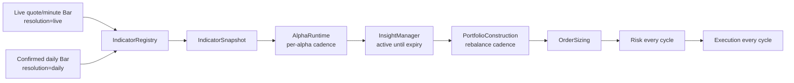

# Runtime Cadence And Resolution

This document defines how LEapsQuantEngine keeps daily strategy logic stable
while the live engine may run on minute or quote cycles.

The goal is simple:

```text
live cycles can run often
daily strategy state should not mutate often
urgent safety checks still run every cycle
```

## Problem

Daily alpha models such as momentum, trend, ETF rotation, and daily trailing
stops should not be recomputed from every live quote. If a 20-day SMA receives a
minute bar, it stops being a 20-day SMA. If portfolio construction runs every
minute from a daily RL allocator, small snapshot changes can create unnecessary
turnover.

The engine therefore separates four concerns:

- data resolution: what kind of bar updated an indicator
- alpha cadence: how often each alpha model generates new insights
- insight persistence: how long a generated thesis remains active
- portfolio cadence: how often active insights become new target weights

Risk and execution remain cycle-based so safety checks and pending target
handling can continue even when daily alpha or portfolio stages are skipped.

## Current Contract



## Data Resolution

`Bar` and `DataSlice` carry a `resolution` field. Universe indicator
definitions can also declare the resolution they accept:

```json
{
  "name": "sma_20_close",
  "type": "sma",
  "period": 20,
  "field": "close",
  "resolution": "daily"
}
```

`IndicatorRegistry` checks the incoming bar before updating each indicator.

Working rules:

- `daily` indicators update from `daily` or `daily_confirmed` bars.
- `live` or `quote` indicators update from live, quote, minute, intraday,
  second, or tick bars.
- `any` preserves old behavior for smoke tests and intentionally generic
  indicators.

Provider defaults:

- daily history loaders stamp bars as `resolution="daily"`.
- live market snapshots stamp provider bars as `resolution="live"` when the
  provider did not specify one.

This means a live snapshot cannot accidentally advance a confirmed daily
momentum or SMA window.

## Alpha Cadence

Python alpha modules may declare cadence metadata:

```python
ALPHA_ID = "leaps-kospi-conviction"
VERSION = "0.1.0"
EVALUATION_CADENCE = "every_cycle"
INPUT_RESOLUTION = "daily"
```

Supported cadence values:

- `every_cycle`: run on every framework cycle.
- `once_per_day`: run at most once per calendar day per `alpha_id`.
- `every_5m` / `every_5_minutes`: interval cadence used mainly by portfolio
  construction.
- `manual`: do not run automatically after startup unless the runtime adds an
  explicit trigger later.

`AlphaRuntime` tracks `last_run_at` by `alpha_id`. When cadence is not due, it
does not call the alpha model. It still publishes an empty `InsightBatch` with:

```json
{
  "metadata": {
    "ran_alpha_ids": [],
    "skipped_alpha_ids": ["leaps-kospi-conviction"],
    "cadence_by_alpha": {
      "leaps-kospi-conviction": "once_per_day"
    }
  }
}
```

Skipping an alpha does not close positions by itself. `InsightManager` keeps
previous insights active until their `expires_at` time.

## Portfolio Cadence

Runtime config controls portfolio target rebuild cadence:

```json
{
  "portfolio": {
    "model": "portfolios/rl_ppo_constructor.py",
    "rebalance": {
      "cash_reserve_pct": 0.0,
      "min_order_notional": 0.0,
      "min_quantity_delta": 1,
      "cadence": "every_5_minutes"
    }
  }
}
```

When cadence is due, `PortfolioConstructionEngine` builds a fresh
`PortfolioTargetBatch` from active insights and current virtual portfolio
state.

When cadence is not due, `FrameworkRunner` reuses the previous target batch's
allocation targets and marks it:

```json
{
  "metadata": {
    "reused": true,
    "source_batch_id": "portfolio-targets-..."
  }
}
```

`OrderSizingEngine` does not trust stale quantity plans from the reused batch.
It reads the persisted `target_percent` values, then recomputes
`desired_value`, `target_quantity`, and `delta_quantity` from the current
virtual portfolio, current mark price, current cash/equity, and current
rebalance policy every cycle.

Risk and execution still run every cycle using those freshly sized quantity
targets. This gives the engine a stable target state instead of interpreting
"no new daily alpha this minute" as "sell everything", while still responding
to fills, cash changes, and price/equity changes.

## Process Boundary State

The current live PowerShell order loop starts a fresh Python process for each
`runtime-run-multi-once`. Plain in-memory cadence state is therefore not enough
for live operation. Use a framework state directory so each sleeve keeps its own
cadence and active insight state:

```powershell
py -3 -m leaps_quant_engine.cli runtime-run-multi-once configs/runtime/live_multi_sleeve.json `
  --sleeve-id LEaps `
  --sleeve-id us_etf_rotation `
  --framework-state-dir data/runtime/framework-state/multi-sleeve `
  --order-batch-output data/runtime/live-order-loop/multi_sleeve_candidate_orders.json
```

The state file persists:

- active insights
- alpha last-run timestamps
- last portfolio run timestamp
- last portfolio target batch

Operator/reporting commands may pass `--framework-state-read-only` so they can
inspect the current target state without advancing cadence or changing the live
state file.

## Exit And Safety Path

Daily cadence must not be the only exit path.

Use these layers for urgent behavior:

- Risk model: always-on clamps, exposure limits, oversell prevention, stale
  snapshot entry blocks, and emergency reduce/flat rules.
- Quote or intraday alpha: explicit `every_cycle` model for live stop logic when
  the strategy truly needs quote-level reassessment.
- Execution/order runtime: ticket lifecycle, duplicate submit protection,
  pending order awareness, and broker fill reconciliation.

Daily alpha and daily portfolio cadence are for strategy thesis updates, not
for all safety behavior.

## LEaps Current Settings

The live config `configs/runtime/live_multi_sleeve.json` currently uses:

```text
LEaps alpha:
  leaps-kospi-conviction         -> every_cycle, daily
  leaps-volatility-trailing-stop -> every_cycle, daily

LEaps portfolio:
  rl_ppo_constructor.py
  rebalance.cadence = every_5_minutes

LEaps indicators:
  configs/universes/leaps_kr_research_core.json
  strategy indicators are resolution=daily
```

`LEaps` and `us_etf_rotation` run in the same live runner, but each sleeve keeps
separate cash currency, account route, alpha, portfolio, risk, execution, and
framework state.

## Operator Checklist

Before live open or after restart:

1. Warm daily indicators from cache/history.
2. Confirm snapshot quality is not blocked by `warmup_not_ready`.
3. Confirm daily alpha models are configured with `EVALUATION_CADENCE`.
4. Confirm portfolio rebalance cadence matches the strategy horizon.
5. Confirm urgent exits are covered by risk or explicitly live-resolution
   models.

When changing a daily alpha parameter:

1. Edit the alpha module or config.
2. Trigger the controlled reload path or restart the bounded runtime process.
3. Let bootstrap/warmup rebuild the indicator snapshot.
4. Dry-run one cycle and inspect `stage_decisions.alpha` and
   `stage_decisions.portfolio`.

## Backtest Expectations

Backtests should preserve the same contract:

- daily historical feed uses `resolution="daily"`
- indicator readiness is warmed before the evaluation period when needed
- alpha cadence is honored by `AlphaRuntime`
- portfolio target persistence is honored by `FrameworkRunner`
- sizing recomputes current quantities from persisted target percentages
- risk and execution still run every replay cycle

If a backtest uses minute bars with daily indicators, it must either provide a
daily consolidator or keep those daily indicators from consuming minute bars.
Do not silently mix the streams.
