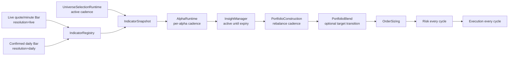

# Runtime Cadence And Resolution

This document defines how LEapsQuantEngine keeps daily strategy logic stable
while the live engine may run on minute or quote cycles.

The goal is simple:

```text
live cycles can run often
daily strategy state should not mutate often
urgent safety checks still run every cycle
```

## Problem

Daily alpha models such as momentum, trend, ETF rotation, and daily trailing
stops should not be recomputed from every live quote. If a 20-day SMA receives a
minute bar, it stops being a 20-day SMA. If portfolio construction runs every
minute from a daily RL allocator, small snapshot changes can create unnecessary
turnover.

The engine therefore separates four concerns:

- data resolution: what kind of bar updated an indicator
- active universe cadence: how often the monitored symbol set is refreshed
- alpha cadence: how often each alpha model generates new insights
- insight persistence: how long a generated thesis remains active
- portfolio cadence: how often active insights become new target weights

Risk and execution remain cycle-based so safety checks and pending target
handling can continue even when daily alpha or portfolio stages are skipped.

## Current Contract



## Data Resolution

`Bar` and `DataSlice` carry a `resolution` field. Universe indicator
definitions can also declare the resolution they accept:

```json
{
  "name": "sma_20_close",
  "type": "sma",
  "period": 20,
  "field": "close",
  "resolution": "daily"
}
```

`IndicatorRegistry` checks the incoming bar before updating each indicator.

Working rules:

- `daily` indicators update from `daily` or `daily_confirmed` bars.
- `live` or `quote` indicators update from live, quote, minute, intraday,
  second, or tick bars.
- `any` preserves old behavior for smoke tests and intentionally generic
  indicators.
- Incoming bars stamped as `any`, `unknown`, or left blank do not update
  confirmed daily indicators. Adapters must identify the stream before it
  reaches the registry.

Provider defaults:

- daily history loaders stamp bars as `resolution="daily"`.
- live market snapshots stamp provider bars as `resolution="live"` when the
  provider did not specify one.
- snapshot worker reports expose `indicator_update_count` and
  `indicator_resolution_mismatch_count` so operators can see when a live cycle
  intentionally skipped confirmed daily indicator updates.

This means a live snapshot cannot accidentally advance a confirmed daily
momentum or SMA window.

## Snapshot Lanes

Resolution is enforced before indicators and also at the snapshot boundary.
This is the LEAN-style subscription/consolidator equivalent in LEaps.

```text
daily/history feed   -> MarketDataSnapshot(lane=daily_confirmed)
minute replay/feed   -> MarketDataSnapshot(lane=minute)
live quote feed      -> MarketDataSnapshot(lane=quote)
```

One `MarketDataSnapshot` may contain many symbols, but it must contain exactly
one lane. Creating a snapshot with mixed daily and minute/quote bars is rejected.
This prevents the common mistake where a daily strategy accidentally sees a
live quote as if it were a confirmed daily bar.

`IndicatorSnapshot` carries the same lane as its source market-data snapshot,
and `IndicatorSnapshotStore` stores active/pending snapshots by lane. The old
`active()` call still returns the most recently published lane for compatibility,
but runtime code should prefer explicit lanes when it needs a specific stream:

```text
store.active("daily_confirmed")
store.active("minute")
store.active("quote")
```

Runtime data-slice reconstruction also follows the lane. If a framework cycle
uses an indicator snapshot from `quote`, it reads the latest quote market
snapshot. If it uses `daily_confirmed`, it does not silently fall back to a
minute or quote snapshot.

Snapshot store records include `snapshot.lane`, and latest lookup can be
filtered by lane. This makes report/debug flows able to say which stream
actually drove a cycle.

## Active Universe Cadence

Runtime config controls active selection cadence independently from alpha and
portfolio cadence:

```json
{
  "universe": {
    "active": {
      "cadence": "startup_only",
      "selection_model": "leaps_quant_engine.universe.selection:StaticUniverseSelectionModel"
    }
  }
}
```

Supported values:

- `startup_only`: select once during bootstrap and reuse until reload or forced
  refresh. This is the backward-compatible default.
- `once_per_day`: refresh at most once per calendar day.
- interval aliases such as `every_5m` or `every_5_minutes`.

The runtime persists active-universe state in `RuntimeStateStore` under
`engine-universe-selection / active_universe`. When cadence is due, selection
runs against the latest snapshot context, then the worker receives the new
active universe at a cycle boundary through `BackgroundSnapshotWorker.update_universe(...)`.

The forced-live invariant still applies on every refresh:

```text
active live universe =
  selected symbols
  + held symbols
  + open-order symbols
  + exit-watch symbols
  + manual/operator symbols
```

Do not use active universe cadence to hide held or pending symbols from market
data. Selection cadence controls candidate refresh, not exit visibility.

## Opening And Extended Sessions

Opening-auction and extended-session rows are valid market context, but they are
not confirmed daily bars. Minute replay/cache rows may carry:

```text
market_session_phase
is_regular_market_open
is_orderable_session
is_extended_market_hours
```

Models can use these values to reason about expected open, gap risk, urgency,
or execution sizing. The indicator registry still relies on `resolution`, so a
pre-open minute row should remain `resolution="minute"` and must not advance
daily SMA, momentum, ATR, or volatility indicators.

The LEAN-like split is:

- subscription/session controls decide whether extended data enters the engine
- `Bar.metadata` says which session produced the row
- alpha/execution models explicitly opt into using that context
- confirmed daily indicators stay on daily/history data

If snapshot quality is `invalid`, `FrameworkRunner` does not run alpha or
portfolio construction for that cycle. Active insights are suppressed from that
cycle's portfolio input, but the insight ledger is not cancelled solely because
of a transient bad snapshot. This keeps contaminated current data out of new
orders without erasing a valid previous daily thesis.

## Indicator Readiness

Universe indicator definitions may mark a feature as optional for warmup:

```json
{
  "name": "roc_60_close",
  "type": "roc",
  "period": 60,
  "field": "close",
  "resolution": "daily",
  "readiness": "optional"
}
```

Working rules:

- `readiness="required"` is the default and participates in
  `required_warmup_bars`, symbol readiness, and `warmup_not_ready` entry
  gating.
- Legacy-style `required_for_warmup: false` is accepted as an alias for
  `readiness="optional"` when loading universe JSON.
- `readiness="optional"` indicators are still registered and updated when
  history exists, but they do not block live entries or warmup readiness by
  themselves.
- Warmup reports include required and optional readiness counts separately, so
  operators can distinguish a hard readiness failure from a missing research
  feature.
- Models should treat optional indicators as nullable context and fall back to
  shorter-horizon signals when the value is absent.

## Alpha Cadence

Python alpha modules may declare cadence metadata:

```python
ALPHA_ID = "leaps-kospi-conviction"
VERSION = "0.1.0"
EVALUATION_CADENCE = "every_cycle"
INPUT_RESOLUTION = "daily"
```

Supported cadence values:

- `every_cycle`: run on every framework cycle.
- `once_per_day`: run at most once per calendar day per `alpha_id`.
- `daily_at 08:50 Asia/Seoul` or `every_trading_day_at 08:50
  Asia/Seoul`: run once per weekday, only after the configured wall-clock
  time.
- `week_start_at 08:55 Asia/Seoul`: run once per ISO week on the first
  weekday cycle that reaches the configured wall-clock time.
- `weekly_at Wednesday 08:55 Asia/Seoul`: run once per ISO week on the named
  weekday after the configured wall-clock time.
- `every_5m` / `every_5_minutes`: interval cadence used mainly by portfolio
  construction.
- `manual`: do not run automatically after startup unless the runtime adds an
  explicit trigger later.

`AlphaRuntime` tracks `last_run_at` by `alpha_id`. When cadence is not due, it
does not call the alpha model. It still publishes an empty `InsightBatch` with:

```json
{
  "metadata": {
    "ran_alpha_ids": [],
    "skipped_alpha_ids": ["leaps-kospi-conviction"],
    "cadence_by_alpha": {
      "leaps-kospi-conviction": "once_per_day"
    }
  }
}
```

Skipping an alpha does not close positions by itself. `InsightManager` keeps
previous insights active until their `expires_at` time.

`once_per_day` intentionally remains backward compatible: the first valid cycle
of a day runs, whether it is 08:30 or 10:00. Use a scheduled cadence when the
model must wait for a specific trading-calendar time.

## Portfolio Cadence

Runtime config controls portfolio target rebuild cadence:

```json
{
  "portfolio": {
    "model": "portfolios/rl_ppo_constructor.py",
    "rebalance": {
      "cash_reserve_pct": 0.0,
      "min_order_notional": 0.0,
      "min_quantity_delta": 1,
      "cadence": "week_start_at 08:55 Asia/Seoul"
    }
  }
}
```

When cadence is due, `PortfolioConstructionEngine` builds a fresh
`PortfolioTargetBatch` from active insights and current virtual portfolio
state.

When cadence is not due, `FrameworkRunner` reuses the previous target batch's
allocation targets and marks it:

```json
{
  "metadata": {
    "reused": true,
    "source_batch_id": "portfolio-targets-..."
  }
}
```

`OrderSizingEngine` does not trust stale quantity plans from the reused batch.
It reads the persisted `target_percent` values, then recomputes
`desired_value`, `target_quantity`, and `delta_quantity` from the current
virtual portfolio, current mark price, current cash/equity, and current
rebalance policy every cycle.

Risk and execution still run every cycle using those freshly sized quantity
targets. This gives the engine a stable target state instead of interpreting
"no new daily alpha this minute" as "sell everything", while still responding
to fills, cash changes, and price/equity changes.

If a scheduled portfolio cadence is not due and no previous target batch exists,
the runner emits an empty target batch with
`portfolio_skipped_reason=cadence_not_due`. This is deliberate: scheduled
portfolio construction should not silently run early just because the process
started before the configured rebalance time.

## Execution Windows

Execution cadence belongs to the execution model, because the model owns order
type, urgency, replacement policy, and patient/urgent trading windows. The
standard execution models support optional side-specific wall-clock windows via
model parameters:

```json
{
  "execution": {
    "model": "leaps_quant_engine.execution:ImmediateExecutionModel",
    "parameters": {
      "buy_window": "09:05-14:50 Asia/Seoul",
      "window_timezone": "Asia/Seoul"
    }
  }
}
```

Outside `buy_window`, the standard execution model suppresses new buy intents.
Sell intents still pass unless `sell_window` is also configured. This keeps
patient entry scheduling out of alpha/portfolio code while still allowing risk
or exit maintenance to operate each framework cycle.

## Portfolio Blend

Portfolio Blend is an optional operational transition layer after target
resolution and before order sizing.

It is meant for this situation:

```text
old complete target snapshot -> new complete target snapshot
```

It is not implemented as "run old Python model plus new Python model." The
engine stores the previous committed target percentages, compares them to the
current resolved `PortfolioTargetBatch`, and linearly moves from the old weights
to the new weights over `portfolio.blend.duration_minutes`.

Target resolution happens first:

```text
portfolio model raw output
  -> PortfolioTargetResolver
  -> resolved complete target vector
  -> PortfolioBlendEngine
```

Default `portfolio.target_resolution.mode="complete"` means an omitted old or
held symbol is resolved to an explicit 0% target before blend when the new raw
batch contains at least one target. That makes model migrations cross-fade
naturally: old-only symbols fade out, new-only symbols fade in, and shared
symbols move from old weight to new weight. An empty raw batch is treated as
`empty_no_action` by default so a missing/expired insight set does not become an
implicit all-sell signal; models that truly want all-cash should emit explicit
0% targets or opt into `zero_missing_when_raw_empty=true`. Use `mode="patch"`
only for a portfolio model that intentionally emits partial patches; in that
mode omitted previous targets are carried forward before blend.

Runtime config:

```json
{
  "portfolio": {
    "target_resolution": {
      "mode": "complete"
    },
    "blend": {
      "enabled": true,
      "duration_minutes": 300,
      "target_drift_threshold_pct": 0.08,
      "clock": "orderable_session"
    }
  }
}
```

Working rules:

- `target_drift_threshold_pct` is an L1 target-weight drift threshold. A 4%
  decrease in one symbol and 4% increase in another is `0.08`.
- `clock="orderable_session"` advances only when the current market session is
  orderable. `regular_session` requires regular market open, and `wall_time`
  advances on elapsed cycle timestamps.
- Active blend state is written through runtime state under
  `engine-portfolio-blend / active_transition`.
- `FrameworkRunner` can advance an active blend on non-due portfolio cadence
  cycles without re-running the portfolio model.
- Tags containing `:flat`, `:down`, `stop`, `urgent`, `manual`, `operator`,
  `force`, `risk`, `no_longer_in_target_portfolio`, or
  `missing_target_zero` bypass the blend for that symbol. These exits should
  not be slowed by an operational transition.
- Retargeting during an active blend preserves the active transition clock. A
  changed destination target can update `to_weights`, but the original
  `started_at` and `deadline_at` remain in force. The engine records
  `from_elapsed_minutes` on retarget so the effective target does not jump when
  the model's desired percentages move during the transition.
- Portfolio Blend does not decide whether a missing target means carry-forward
  or zero. That decision belongs to `PortfolioTargetResolver`.

Order sizing still recomputes quantities from the blended percentages, current
virtual account, current cash/equity, and current prices every cycle.

## Process Boundary State

The current live PowerShell order loop starts a fresh Python process for each
`runtime-run-multi-once`. Plain in-memory cadence state is therefore not enough
for live operation. Use a framework state directory so each sleeve keeps its own
cadence and active insight state:

```powershell
py -3 -m leaps_quant_engine.cli runtime-run-multi-once configs/runtime/live_multi_sleeve.json `
  --sleeve-id LEaps `
  --sleeve-id us_etf_rotation `
  --framework-state-dir data/runtime/framework-state/multi-sleeve `
  --order-batch-output data/runtime/live-order-loop/multi_sleeve_candidate_orders.json
```

The state file persists:

- active insights
- alpha last-run timestamps
- last portfolio run timestamp
- last portfolio target batch

Operator/reporting commands may pass `--framework-state-read-only` so they can
inspect the current target state without advancing cadence or changing the live
state file.

Stateful models need one more store. Pass `--runtime-state` to attach the
SQLite model-state store:

```powershell
py -3 -m leaps_quant_engine.cli runtime-run-multi-once configs/runtime/live_multi_sleeve.json `
  --sleeve-id LEaps `
  --sleeve-id us_etf_rotation `
  --framework-state-dir data/runtime/framework-state/multi-sleeve `
  --runtime-state data/runtime/runtime-state/live_multi_sleeve.sqlite `
  --order-batch-output data/runtime/live-order-loop/multi_sleeve_candidate_orders.json
```

Framework state answers "what target thesis is currently active?" Runtime
model state answers "what stateful model memory should survive restart?" Keep
them separate.

Portfolio Blend uses runtime model state for active transition progress. The
framework state still persists the latest target batch so reporting and
cadence reuse stay readable across process boundaries.

## Sleeve Runtime Cadence

The live multi-sleeve process has two clocks:

- supervisor tick: how often the bounded PowerShell loop wakes up
- sleeve runtime cadence: how often a specific sleeve is passed to
  `runtime-run-multi-once`

The supervisor tick is the `-IntervalSeconds` argument of
`tools/leaps_multi_sleeve_live_order_loop.ps1`. Sleeve runtime cadence comes
from each sleeve's config:

```json
{
  "sleeve_id": "LEaps",
  "worker": {
    "cycle_interval_seconds": 60
  }
}
```

At each supervisor tick, the loop first applies the sleeve schedule window and
then applies `worker.cycle_interval_seconds`. A sleeve skipped by cadence is
reported in the live log as `cadence_wait:<seconds>`. This keeps a single
multi-sleeve runner while allowing different strategy horizons:

```text
supervisor tick: 10s
LEaps worker.cycle_interval_seconds: 60
us_etf_rotation worker.cycle_interval_seconds: 300
future fast-risk sleeve/lane: 10-15s
```

The supervisor tick must be less than or equal to the fastest sleeve cadence
you want to honor. If the process wakes every 60 seconds, a sleeve configured
for 15 seconds cannot run every 15 seconds.

This setting controls full sleeve runtime cycles. It does not replace alpha,
portfolio, selection, or execution cadence. Those remain model/stage-level
cadences inside the cycle.

## Snapshot Freshness Defaults

Runtime freshness is resolution-aware. The engine should not block a cycle
until KIS has answered every requested symbol. Collectors publish the latest
available snapshot, and the runtime decides with quality metadata:

- quote fresh: age <= 10 seconds in regular sessions
- extended quote fresh: age <= 30 seconds
- confirmed 1-minute bar fresh: latest completed minute is present
- confirmed 1-minute bar degraded: one completed bar behind, within tolerance
- account/cash/holdings fresh: age <= 60 seconds
- open-ticket order status fresh: age <= 10 seconds
- closed/no-open-ticket order status fresh: age <= 60 seconds
- confirmed daily fresh: expected last confirmed trading day is present

Freshness helpers live in `leaps_quant_engine.snapshots`:

```python
evaluate_quote_freshness(...)
evaluate_confirmed_minute_freshness(...)
evaluate_daily_confirmed_freshness(...)
evaluate_account_freshness(...)
evaluate_order_status_freshness(...)
```

New entries should require fresh quote and fresh model input. Risk reduction and
exit paths may continue on degraded or stale data when the model/execution
policy explicitly allows it.

`runtime-health` can inspect portfolio blend runtime state when the SQLite store
is provided:

```powershell
py -3 -m leaps_quant_engine.cli runtime-health configs/runtime/live_multi_sleeve.json `
  --runtime-state data/runtime/runtime-state/live_multi_sleeve.sqlite `
  --summary-only
```

The health report flags active transitions whose `deadline_at` has passed,
transitions due for completion, and legacy/malformed active blend state without
a deadline. Treat those as startup recovery signals: run a bounded runtime cycle
or preflight/reload before allowing fresh live order submission.

## Market Session Gate

Runtime cycles may include multiple market scopes. The framework passes
normalized `MarketSession` objects into execution context, and order submit
guards use the same session metadata before touching KIS.

Working rules:

- Daily alpha/portfolio cadence is independent of orderable sessions.
- Execution models may choose whether to emit regular, pre-market, or
  after-hours order intents.
- Broker/session capability checks remain core guards.
- KRX and US calendar reports are available to preflight/runtime health. Built-in
  weekend/session rules always run; optional holiday JSON files improve holiday
  accuracy and missing files are reported as degraded quality.
- Do not encode holiday assumptions inside alpha or portfolio models. Use the
  normalized session/calendar metadata provided by the runtime boundary.

## Warmup Sources

Live warmup should prefer cache/history providers and produce confirmed daily
indicator state before the first live cycle. FinanceDataReader is used as a
daily fallback provider in the current adapter stack; it should not be treated
as the v0 source of 30-day minute bars.

Temporal PPO windows are produced from the same confirmed daily history lane,
not from live quote snapshots. When a sleeve portfolio uses a temporal
`feature_schema`, runtime bootstrap creates a `TemporalFeatureWindowProvider`,
warms it from daily history, and attaches point-in-time rows to
`SnapshotContext` symbol metadata. Minute or quote cycles may consume the latest
available daily window, but they must not advance it.

For minute simulation:

- Use existing minute replay files when available.
- Use `download-us-minute-feed` for US minute research feeds, understanding
  that public providers may limit how much 1-minute history is available.
- For deterministic multi-day minute replay, prefer our own live collector or
  KIS/cache artifacts over ad-hoc downloads.

## Freshness Runtime Decisions

Freshness is now an engine decision, not only model advice.

- `fresh`: alpha may emit entry and exit insights.
- `degraded`: the framework suppresses new UP entry insights, but keeps
  DOWN/FLAT insights so exits and risk reductions can still flow.
- `stale` or `invalid`: risk and report layers treat this as attention-worthy;
  invalid snapshots skip alpha/portfolio construction for that cycle.

This mirrors the LEAN-style separation we want: models can read
`context.allows_new_entries`, but the runtime also enforces the entry gate so a
single model cannot accidentally buy from stale or degraded quote state.

The snapshot store records the same quality payload per sleeve when configured,
which lets reports explain whether a no-order cycle was strategy-driven or
freshness-blocked.

## Exit And Safety Path

Daily cadence must not be the only exit path.

Use these layers for urgent behavior:

- Risk model: always-on clamps, exposure limits, oversell prevention, stale
  snapshot entry blocks, and emergency reduce/flat rules.
- Quote or intraday alpha: explicit `every_cycle` model for live stop logic when
  the strategy truly needs quote-level reassessment.
- Execution/order runtime: ticket lifecycle, duplicate submit protection,
  pending order awareness, and broker fill reconciliation.

Daily alpha and daily portfolio cadence are for strategy thesis updates, not
for all safety behavior.

## LEaps Current Settings

The live config `configs/runtime/live_multi_sleeve.json` currently uses:

```text
LEaps alpha:
  leaps-kospi-conviction         -> every_cycle, daily
  leaps-volatility-trailing-stop -> every_cycle, daily

LEaps portfolio:
  rl_ppo_constructor.py
  rebalance.cadence = every_5_minutes
  blend.enabled = true
  blend.duration_minutes = 300
  blend.clock = orderable_session

LEaps indicators:
  configs/universes/leaps_kr_research_core.json
  strategy indicators are resolution=daily
```

`LEaps` and `us_etf_rotation` run in the same live runner, but each sleeve keeps
separate cash currency, account route, alpha, portfolio, risk, execution, and
framework state.

## Operator Checklist

Before live open or after restart:

1. Warm daily indicators from cache/history.
2. Confirm snapshot quality is not blocked by `warmup_not_ready`.
3. Confirm daily alpha models are configured with `EVALUATION_CADENCE`.
4. Confirm portfolio rebalance cadence matches the strategy horizon.
5. Confirm urgent exits are covered by risk or explicitly live-resolution
   models.

When changing a daily alpha parameter:

1. Edit the alpha module or config.
2. Trigger the controlled reload path or restart the bounded runtime process.
3. Let bootstrap/warmup rebuild the indicator snapshot.
4. Dry-run one cycle and inspect `stage_decisions.alpha` and
   `stage_decisions.portfolio`.

## Backtest Expectations

Backtests should preserve the same contract:

- daily historical feed uses `resolution="daily"`
- indicator readiness is warmed before the evaluation period when needed
- alpha cadence is honored by `AlphaRuntime`
- portfolio target persistence is honored by `FrameworkRunner`
- sizing recomputes current quantities from persisted target percentages
- risk and execution still run every replay cycle

If a backtest uses minute bars with daily indicators, it must either provide a
daily consolidator or keep those daily indicators from consuming minute bars.
Do not silently mix the streams.
